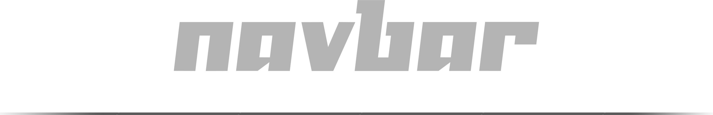

<!-- ╔══════════════════════════════ BEG ══════════════════════════════╗ -->

<br>
<div align="center">
    <p>
        
    </p>
</div>

<div align="center">
    
    <a href="https://github.com/cruxkit-org"></a>
    <br>
    
    
    
</div>
<br>

<!-- ╚═════════════════════════════════════════════════════════════════╝ -->


<!-- ╔══════════════════════════════ DOC ══════════════════════════════╗ -->

- ## Overview 👀
    - #### Why ?
        > To compose navbars from small layout primitives instead of hand‑rolled flex code.

    - #### When ?
        > When you need a layout for logo, links, search and actions that stays consistent across pages.

    <br>
    <br>

- ## Quick Start 🔥

    > install [`hmm`](https://github.com/minejs-org/hmm) first.

    ```bash
    # in your terminal
    hmm i @cruxkit/navbar
    ```

    ```ts
    // in your ts files
    import { Navbar } from `@cruxkit/navbar`;
    ```

    <div align="center">  </div>
    <br>


    - ### Basic usage

        ```tsx
        let isDark: undefined | Signal<boolean> = undefined;

        // ─────────────────────────────── SIDEBAR CONTENT ─────────────────────────────

        const SidebarContent = (): JSXElement => (
            <Container display="flex" direction="column" h="full">
                <Container p={4} className="border-b border-1">
                    <Container display="flex" justify="between" align="center">
                        <h2 className="text-lg font-semibold">Menu</h2>
                        <label
                            htmlFor="app-sidebar"
                            className="
                                flex
                                items-center
                                justify-center
                                size-8
                                rounded-md
                                cursor-pointer
                                hover:bg-brand-subtle
                                focus:outline-none
                                focus:ring-2
                                focus:ring-brand
                            "
                            tabIndex={0}
                            role="button"
                            aria-label="Close sidebar"
                            onKeyDown={(e: KeyboardEvent) => {
                                if (e.key === 'Enter' || e.key === ' ') {
                                    e.preventDefault();
                                    (e.target as HTMLLabelElement).click();
                                }
                            }}
                        >
                            <Icon name="x" size="md" />
                        </label>
                    </Container>
                </Container>

                {/* Sidebar Body */}
                <Container display="flex" direction="column" gap={2} p={4} className="flex-1 overflow-y-auto">
                    <Button variant="ghost" color="neutral" className="justify-between w-full" rightIcon={{name: 'home'}}>
                        {t("common.home")!}
                    </Button>
                    
                    <Button variant="ghost" color="neutral" className="justify-between w-full" rightIcon={{name: 'book-open'}}>
                        {t("common.docs")!}
                    </Button>

                    <Container className="border-t border-1 my-2" />

                    <Dropdown
                        variant="ghost" 
                        color="neutral" className="justify-between w-full" 
                        trigger={t("common.lang")!}
                        triggerIcon={'language'}
                        triggerDisplay="icon-label"
                        options={[
                            { label: 'العربية', value: 'ar' },
                            { label: 'English', value: 'en' }
                        ]}
                        styleMode='classic'
                        autoDivider={true}
                        labelArrow
                        onSelect={v => { setLang(v as string); window.location.reload();
                                toast.info(t("toast.lang_toggled")!);
                            }}
                    />

                    <Button
                        variant="ghost"
                        color="neutral"
                        className="justify-between w-full"
                        onClick={() => {
                            toggleTheme();
                            toast.info(t("toast.theme_toggled")!);
                        }}
                        rightIcon={{name: getCurrentTheme() === 'light' ? 'sun' : 'moon'}}
                    >
                        {t("common.theme")!}
                    </Button>
                </Container>

                {/* Sidebar Footer */}
                <Container p={4} className="border-t border-1">
                    <Button variant="solid" color="brand" className="w-full" leftIcon={{name: 'github'}} href="https://github.com/maysara-elshewehy"
                    onClick={() => window.open('https://github.com/maysara-elshewehy', '_blank')}>
                        {t("common.follow_me")!}
                    </Button>
                </Container>
            </Container>
        );

        // ─────────────────────────────── NAVBAR ITEMS ────────────────────────────────

        const items: NavItem[] = [
            // Logo
            {
                type: 'logo',
                position: 'start',
                divider: false,
                content: (
                    
                )
            },

            // Links
            {
                type: 'links',
                position: 'center',
                divider: true,
                dividerMainOnMobile: 'hidden',
                content: () => (
                    <Button variant="ghost" color="neutral">
                        {t("common.home")!}
                    </Button>
                )
            },
            {
                type: 'links',
                position: 'center',
                content: () => (
                    <Dropdown
                        trigger={t("common.docs")!}
                        triggerDisplay="label-icon"
                        options={[
                            { label: 'Core', value: 'core' },
                            { label: 'Text', value: 'text' }
                        ]}
                        styleMode='classic'
                        autoDivider={true}
                        labelArrow
                    />
                )
            },

            // Actions
            {
                type: 'actions',
                position: 'end',
                divider: true,
                dividerMainOnMobile: 'hidden',
                content: () => (
                    <Dropdown
                        trigger="Language"
                        triggerIcon={'language'}
                        triggerDisplay="icon-only"
                        options={[
                            { label: 'العربية', value: 'ar' },
                            { label: 'English', value: 'en' }
                        ]}
                        styleMode='classic'
                        autoDivider={true}
                        labelArrow
                        onSelect={
                            v => {
                            setLang(v as string); window.location.reload();
                            toast.info(t("toast.lang_toggled")!);
                        }}
                    />
                )
            },
            {
                type: 'actions',
                position: 'end',
                divider: true,
                dividerMainOnMobile: 'hidden',
                content: () => (
                    <Button
                        id="theme_button"
                        variant='ghost'
                        color="brand"
                        onMount={() => {
                            console.log('onMount');
                        }}
                        onLoad={(el) => {
                            console.log('onLoad');
                            isDark = signal(getCurrentTheme() === 'dark');

                            effect(() => {
                                console.log('onEffect');
                                if (typeof document === 'undefined') return;
                                const svg = isDark && isDark() ? Icon('sun')! : Icon('moon')!;
                                
                                render(svg, '#theme_button span > svg')
                                const btn = document.querySelector('#theme_button span > svg')
                                if(btn) render(svg, btn as HTMLElement)
                            });
                        }}
                        onClick={() => {
                            console.log('onClick');
                            if (isDark === undefined) return;

                            const _isDark = isDark();
                            const next = !_isDark;
                            isDark.set(next);

                            toggleTheme();
                            toast.info(t("toast.theme_toggled")!);
                        }}
                    >
                        <Icon name={getCurrentTheme() == 'light' ? 'sun' : 'moon'}></Icon>
                    </Button>
                )
            },
            {
                type: 'actions',
                position: 'end',
                keepOnMobile: true,
                dividerMainOnMobile: 'hidden',
                content: () => (
                    <Button variant='ghost' color="brand">
                        <Icon name='dungeon'></Icon>
                    </Button>
                )
            },
        ];

        // ─────────────────────────────── NAVBAR CONFIG ───────────────────────────────

        const navProps: NavProps = {
            mode: 'horizontal',
            gap: 'md',
            sticky: true,
            items,
            config: {
                logo: {
                    position: 'start',
                    gap: 'md',
                },
                links: {
                    position: 'center-start',
                    gap: 'md',
                },
                actions: {
                    position: 'end',
                    gap: 'sm',
                },
            },
            
            className: 'px-4 h-12',

            dividerMax: 50,
            dividerOpacity: 50,
            dividerSpacing: 0,

            // Sidebar Integration
            sidebar: {
                id: 'app-sidebar',
                component: SidebarContent,
                position: 'end',
                width: 'md',
                backdrop: true,
                closeOnBackdrop: true,
                closeOnEscape: true,
                transition: 'slide',
                duration: 300,
                zIndex: 50,
                showToggle: true,
                toggleIcon: 'bars',
            }
        };

        export const Navbar = (): JSXElement => {
            return NavbarKit(navProps);
        };
        ```

    <br>
    <br>

- ## Documentation 📑


    - ### API ⛓️

        - #### Functions

            ```tsx
            // Renders a responsive navigation bar with configurable sections and items.
            export function Navbar(props: NavProps): JSXElement

            // Renders a responsive, animated sidemenu drawer.
            export function Sidemenu(props: SidemenuProps): JSXElement
            ```

        - #### Types

            ```tsx
            // ─────────────────────────────── NAVBAR TYPES ────────────────────────────────

            export type NavItemPosition     = 'start' | 'center' | 'center-start' | 'center-end' | 'end';
            export type NavItemAlign        = 'flex-start' | 'center' | 'flex-end';
            export type NavLayoutMode       = 'horizontal' | 'vertical';
            export type NavSpacing          = 'sm' | 'md' | 'lg';

            export type NavItemType =
                | 'logo'
                | 'links'
                | 'actions'
                | 'search'
                | 'divider'
                | 'custom';

            export type NavItemPositionMap = Partial<Record<NavItemType, NavItemPosition>>;

            export type NavDividerOnMobile = 'hidden' | 'visible' | 'horizontal' | 'vertical';

            export type NavItemContent = JSXElement | JSXElement[] | (() => JSXElement | JSXElement[]);

            export interface NavItem {
                type                        : NavItemType;
                content?                    : NavItemContent;
                position?                   : NavItemPosition;
                align?                      : NavItemAlign;
                responsive?                 : Partial<Record<'mobile' | 'tablet' | 'desktop', NavItemPosition>>;
                keepOnMobile?               : boolean;
                divider?                    : boolean;
                dividerMainOnMobile?        : NavDividerOnMobile;
            }

            export interface NavTypeConfig {
                position?                   : NavItemPosition;
                gap?                        : NavSpacing | ContainerGap;
            }

            export type NavConfigMap = Partial<Record<NavItemType, NavTypeConfig>>;


            // ─────────────────────────────── SIDEBAR TYPES ───────────────────────────────

            export type SidemenuPosition     = 'start' | 'end';
            export type SidemenuWidth        = 'sm' | 'md' | 'lg' | 'xl' | 'full' | string | number;

            export interface SidemenuConfig {
                // Core
                id                          : string;
                component                   : JSXElement | (() => JSXElement);
                position?                   : SidemenuPosition;
                width?                      : SidemenuWidth;
                
                // Behavior
                backdrop?                   : boolean;
                closeOnBackdrop?            : boolean;
                closeOnEscape?              : boolean;
                
                // Animation
                transition?                 : 'slide' | 'fade' | 'none';
                duration?                   : number;
                
                // Styling
                className?                  : string;
                zIndex?                     : 0 | 10 | 20 | 30 | 40 | 50 | 60 | 70 | 80 | 90 | 100;

                // Toggle button customization
                toggleIcon?                 : string;
                toggleClassName?            : string;
                showToggle?                 : boolean;
            }


            // ─────────────────────────────── NAVBAR PROPS ────────────────────────────────

            export interface NavProps {
                // Items
                items                       : NavItem[];
                
                // Layout
                mode?                       : NavLayoutMode;
                gap?                        : NavSpacing;
                sticky?                     : boolean;
                config?                     : NavConfigMap;
                
                // Sidemenu Integration
                sidemenu?                    : SidemenuConfig;
                
                // Styling
                className?                  : string;
                
                // Divider customization (main navbar)
                dividerVariant?             : 'solid' | 'dashed' | 'dotted';
                dividerThickness?           : 'super-thin' | 'thin' | 'medium' | 'thick';
                dividerColor?               : '1' | '2' | '3' | 'brand' | 'current';
                dividerSpacing?             : 0 | 1 | 2 | 3 | 4 | 6 | 8 | 12;
                dividerOpacity?             : 0 | 5 | 10 | 20 | 40 | 50 | 60 | 25 | 30 | 70 | 75 | 80 | 90 | 95 | 100;
                dividerMax?                 : number;
            }
            ```

        <div align="center">  </div>
        <br>

    - ### Related 🔗

        - ##### [@minejs/jsx](https://github.com/minejs-org/jsx)

        - ##### [@mineui/utils](https://github.com/mineui-org/utils)

        - ##### [@cruxkit/container](https://github.com/cruxkit-org/container)

        - ##### [@cruxkit/..](https://github.com/cruxkit-org)


<!-- ╚═════════════════════════════════════════════════════════════════╝ -->


<!-- ╔══════════════════════════════ END ══════════════════════════════╗ -->

<br>
<br>

---

<div align="center">
    <a href="https://github.com/maysara-elshewehy"></a>
</div>

<!-- ╚═════════════════════════════════════════════════════════════════╝ -->
